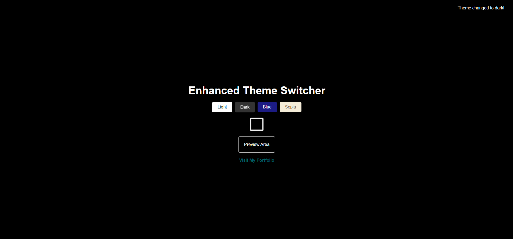
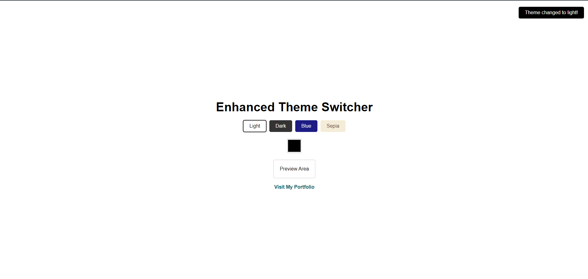

# Task 1: Global App Theme Switcher

## Overview
This project implements a global app theme switcher that allows users to switch between light and dark themes. The theme preference is stored in **localStorage**, so the user's choice is persisted across sessions. The app uses **React Context API** to manage the global theme state.

## Features
- Toggle between light and dark themes.
- The theme preference is saved in localStorage to persist across page reloads.
- Context API is used to manage theme globally across the app.

## Screenshots

### Light Theme

### Dark Theme

## Technologies Used
- **React**
- **Context API**
- **localStorage**

## Installation and Setup
1. Clone the repository.
2. Run `npm install` to install dependencies.
3. Start the app with `npm start`.

## How to Use
1. Toggle the theme switcher in the UI.
2. The app will switch between light and dark themes based on the toggle.
3. The selected theme will be remembered on subsequent visits.

## Files
- `ThemeContext.js`: Defines the Theme Context and provides state management for the theme.
- `App.js`: Main application file where the theme toggle is applied.
- `localStorage.js`: Utility functions to save and retrieve theme data from localStorage.

## Future Improvements
- Add more themes for variety.
- Implement animations for smooth transitions between themes.
